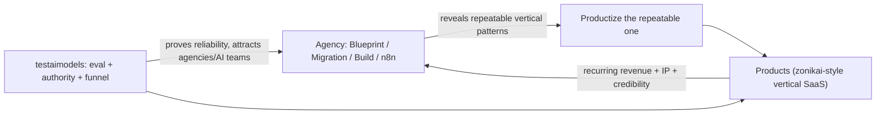

# Eterna Creative - Strategy (Living Document)

> Status: working document, not final decisions. Iterate freely.
> Purpose: the strategic backbone for the website/system redesign and how we position, sell, and compound as an AI-native studio.
> Last updated: 2026-07-18

---

## 1. One-line summary

**"We turn your idea into a validated and scalable product - spec first, built fast, set to grow."**

An AI-native product studio where the **methodology is the product**: validation, spec, design craft, and judgment are our differentiators. Building smart is the critical middle, and we go code or no-code based on where you are at. 

The center of gravity is the **studio**. Our own products are **portfolio assets** that serve as proof, IP, and upside - not the daily focus.

---

## 2. Identity and positioning

- **What we are:** an AI-native product design and developement studio. We build custom, AI-assisted software (Claude Code, Cursor) and use no-code (Bubble) where it fits.
- **Positioning shift:** from "no-code studio" -> "AI-native product studio that ships validated, owned, reliable software - and runs its own products."
- **Custom code as the premium tier:** pitch AI-assisted custom build as the bigger/better/more valuable alternative to no-code. Each new project defaults to custom build from scratch; Bubble stays as a supported option for existing clients and opportunistic Bubble work.
- **A repeatable system, a bespoke product.** Standardize the HOW (methodology, spec system, delivery) for scale, consistency, and margin; deliver a BESPOKE WHAT (custom, high-craft, reliable, owned product). Bespoke lives on the *quality/output* axis; the system lives on the *process* axis. They are not in conflict.

### Core differentiator: reliability + craft

AI-as-a-feature is a commodity. "AI-powered" as a selling point is dead. The hard-to-fake differentiators are the layers AI does NOT commoditize:

- **Reliability / eval** - making non-deterministic AI actually work in production (no hallucination, no leakage, controlled cost). As every product embeds AI, the reliability bar goes *up*, not down.
- **Design craft / UX taste** - AI generates generic "slop" UI; distinctive, high-craft, conversion-oriented design moves *up* the value stack, into the protected zone with judgment.

We can prove reliability in a way almost no competitor can: **we build and run our own AI products.** Most agencies are contractors who've never shipped or operated their own software. We have two live ones.

> Message: "We don't just build AI for you and bill hours - we build and run AI products ourselves, so we know how to make them actually work."

---

## 3. The methodology is the product

The value is the **judgment layer**, which does not commoditize as building gets cheap. Four pillars, mapped to the six engines:

- **Validation** (Engine 01) - research, ICP, PMF signal before code.
- **Spec / architecture** (Engine 02) - the plan that makes AI build reliably.
- **Design craft** (Engines 02, 04) - hero/brand, activation UX; "craft AI can't fake," not "no-code doesn't look like a prototype."
- **Reliability** (Engines 05, 06) - eval discipline, retention/analytics instrumentation, production trust.

Internally: build cost is falling fast (commoditizing) - that is *why* we price the judgment layer, not the typing. Externally we call it "building smart, the critical middle." No-code is one execution lane. The judgment + craft + reliability is what we charge for.

---

## 4. The offer ladder

One system, sold in slices. The products *are* the methodology.

1. **Strategy Call** - free, 15 min. Job: qualify (fit, budget, timeline, decision-maker, seriousness). Keep as the low-friction CTA everywhere.
2. **Scope Session** - free, 1-hour deep dive -> deliverable **"Launch Plan"**: app/page map, hero-screen preview, flat project price, timeline, honest go/no-go. This is the generous FOC hook (shown as total value, not a time menu).
3. **Validation Sprint** - paid. For founders not ready to build who want to validate first. Market + competitive, ICP, validation plan, value prop, success metrics; real go/no-go. (Roughly Engine 01.)
4. **App Launch Blueprint** - paid. For build-ready founders. 2-hour deep-dive session + design moodboard + full spec, architecture, user flows, investor-ready document. Produces a locked, build-ready plan and a firm fixed price. (Roughly Engines 01-02.)
5. **Build** - flat, outcome-based price.
6. **Care / Growth / Scale** - recurring (see pricing).

Validate-first founders enter at the **Validation Sprint**; if it is a go, they graduate to **Blueprint -> Build**. Two entry points, one system.

### The three entry doors (still true, layered on top of the ladder)

- **New idea -> Blueprint** (front door for founders).
- **Existing Bubble app -> Migration** (Bubble -> custom; the unfair wedge / the spear).
- **Running business -> Automation (n8n)** (recurring annuity).

---

## 5. Blueprint model (free vs paid)

The old "free App Launch Blueprint (EUR 800 value)" gave away the judgment layer. Fix: split the two jobs.

- **Job A - close the deal (FREE).** Clients will not say yes without scope + price + timeline, and the hero preview is the emotional yes. This is also the scoping map we need anyway. -> the free **Launch Plan**.
- **Job B - monetize judgment + standalone asset (PAID).** Deep validation, architecture, flows, investor-ready doc. -> **Validation Sprint / App Launch Blueprint**.

Rules:
- Paid tier is **real work, NOT credited to build** (crediting recreates the free-judgment problem).
- Paid tier is a **flat price, not an a-la-carte menu**. Never expose hours or per-item time to the client.
- **Optional by default; effectively required for complex / enterprise / vague scope** - because that is the honest way to give a firm fixed price instead of a range. Framing: "To commit to a firm fixed price, we do the Blueprint first" (de-risking, not a paywall).
- The paid Blueprint **locks scope**, which is what makes the fixed-price build safe (anti-scope-creep mechanism).
- Keep the "budget >= EUR 4,000" qualifier.

---

## 6. Sales process

1. **15-min Strategy Call** (free, low friction). Only job: qualify. Easy yes keeps the funnel wide.
2. **Book the 1-hour Scope Session for another day** (do not default to same-day). This filters (serious people show up), lets us prep so the session is impressive, and protects time. Same-day only if the lead is clearly hot and we are prepped. Reduce drop-off by booking live on the call + sending a 1-page prep doc.
3. **Deliver the free Launch Plan** (flat price, timeline, app map, hero).
4. **Proceed to Build**, or for complex / fundraising cases sell the **Validation Sprint / Blueprint** as the next step.

Caution: the free tier (1 hr + app map + hero) is our CAC. Keep qualification strict and produce the hero/app map with AI + templates to keep the cost lean.

---

## 7. Pricing model (kill hourly, price the outcome)

Principle: **calculate hours internally to protect margin; never sell or expose them.**

- **Build:** single flat, outcome-based price (or 2-3 packaged options), value-anchored to the mistake avoided and the build budget - never line-item hours. The paid Blueprint locking scope is what makes fixed-price safe.
- **Retainer (the trap where hourly sneaks back):** packaged flat-monthly tiers, scope-bounded by deliverables/cadence, not time:
  - **Care** - hosting/monitoring, security, bug fixes, minor tweaks. "Your product stays healthy."
  - **Growth** - Care + one release cycle/month + monthly analytics review + priority fixes (Engines 05-06).
  - **Scale** - Growth + reserved capacity + roadmap partner.
- **Each tier is defined by included outcomes + cadence, not usage or hours.** Need more than the tier covers? Upgrade the tier, or add a one-off fixed-price sprint. No counters, no hours, nothing to track.
- **Automation (n8n):** price per automation outcome + a flat monthly "run & maintain" fee.
- **Revenue share:** reserved for the Creator Co-Build angle only (do not put uncontrollable revenue-outcome risk into normal retainers).

---

## 8. Products = proof + IP + upside

Framed on the site as **proof**, in service of the studio narrative - not a scattered multi-business sprawl.

- **zonikai (zonikai.com):** enterprise AI agent that tracks and calls truck drivers so dispatchers/afterhours teams reduce headcount. Textbook **services-as-software in a real vertical (logistics)**. Early but high potential (clients signaled willingness to pay ~1.5x+). **Has its own partners running sales and ops** - which lets it compound without draining the agency's focus. Big ambition; launching soon.
- **testaimodels (testaimodels.com):** compares LLMs on the same prompt for cost/speed/quality, built for software agencies and AI agent teams. Real value is **authority + top-of-funnel + credibility**, pointing straight at peer/white-label buyers. Aim it at the agency funnel.

### The flywheel

---

## 9. Segments and the niche question

Wide today: founders (startups), creators (brands, professionals), businesses (SMB), hubs (accelerators). No niche locked yet (~15-20 varied products).

- **Founders / SMBs** - rising DIY-with-AI pressure at the low end; value moves to "prototype -> reliable production," rescue, and governed/maintained custom.
- **Creators - reframed.** Fee-for-service creators are weak (AI eats the low end). BUT **creators/mentors/professionals with a real audience are strong as rev-share / co-build partners**, because they have already solved distribution (the #1 product killer).
  - **Creator Co-Build** (GenFlow-inspired): build and co-own products for high-audience creators (fitness, health, podcasts, people of value), aligned via rev-share/equity; their audience is the growth engine. Recurring upside + owned IP.
  - Risk to name: concentrates risk, needs winner-picking + deal-structuring muscle, and depends on the creator actually driving distribution.
- **Approach:** let the data flywheel reveal the agency's vertical rather than forcing one now. The product side already found one (logistics via zonikai) the agency hasn't.

---

## 10. Channels and go-to-market

- Proof-of-work outreach (real builds, real reliability).
- Partner directories (Bubble, n8n) for inbound + migration/automation leads.
- Accelerators / VCs / hubs as a **channel** (founder deal flow), not a vertical.
- **testaimodels as top-of-funnel** to agencies and AI teams.
- **Aligned incentives** as a differentiator: co-funding / revenue-share bets (5 co-funded apps) - skin in the game few agencies offer. (Investor network exists but is minor - do not over-stress it.)
- Still needed: pick **one lead motion + one entry door** to run deep first.

---

## 11. Website = the operating system

- Modular, methodology-encoded sections; products shown as **proof**, not a portfolio dump.
- Lead with the studio; use products for operator credibility.
- Encode the offer ladder (Strategy Call -> Launch Plan -> Validation Sprint / Blueprint -> Build -> Care/Growth/Scale) so offers can be added/retired without a redesign.

---

## 12. Website stress-test / gaps to fix

### Live site - verdict: the OLD positioning; replace, do not patch
- No-code is the identity ("Bronze partner", "no-code-first approach", "Eterna no-code EUR 8,000" vs "Traditional code EUR 40,000+", "your no-code app doesn't have to look like a prototype").
- "AI-powered" as a selling point (AI Co Founder, "we use AI not spreadsheets") - the dead angle.
- Speed framed as the moat ("speed is our advantage") - speed is table stakes; reliability is the moat.
- Low price anchors (EUR 3-8k MVP) on the most-disrupted segment.
- Absent: reliability/eval, owned-code-as-asset, migration, products-as-proof.

### In-progress site - verdict: ~70% aligned; fix these conflicts
1. **Free Blueprint ("EUR 800 value - yours free")** conflicts with monetize-judgment -> implement the two-tier model (Launch Plan free / Validation Sprint + Blueprint paid).
2. **No-code-forward language** - "No-code is not a shortcut - it's the architecture", "all built with the same no-code-first approach", Services led by Bubble/Webflow -> reframe to custom-premium, no-code as one lane.
3. **Reliability/eval wedge nearly absent** -> add it; leverage testaimodels/zonikai as proof.
4. **Migration door does not exist on the site** -> add it (it is the spear).
5. **Tool stack** shows Webflow and only "Claude" -> add Cursor + Claude Code, drop Webflow.
6. **Pricing** still "MVP" language + low anchors -> move to outcome-based flat + the ladder.
7. **Hubs/accelerators dropped** from Solutions -> fine as a channel, but keep it conscious.
8. **Products barely surfaced** -> add a products-as-proof treatment.
9. **Design pitched defensively** -> reframe to "craft AI can't fake."

### Keep and amplify
Six-engines methodology, "AI ended the old era," "Speed is the strategy, systems are the weapon," founder-led / direct-with-Marko / senior-only, "we'll tell you when something's a bad idea," "we build our own products too."

---

## 13. Guardrails

1. **Products = proof, in service of the agency narrative.** Don't let the site become "here are our 3 businesses."
2. **Protect founder attention.** Even with partners, zonikai will pull technical time. Define the boundary now (architect/advisor role; partners run it).
3. **Products don't fix GTM.** The agency still needs one lead motion and one entry door run deep.
4. **Focus > spread.** Agency + 2 products is a lot for a small team. Studio is the center of gravity; everything else visibly serves it.
5. **Keep the free tier lean.** It is CAC - templated + AI-produced, strictly qualified.

---

## 14. Open questions / to validate

- Willingness-to-pay for the **Validation Sprint** and the **App Launch Blueprint** (and the right flat prices).
- The **mandatory-vs-optional threshold** for the paid Blueprint (which complexity/scope triggers "required").
- **Retainer tier pricing + credit sizing** (what S/M/L map to; monthly credit allotments).
- **Which entry door leads first** (Migration spear vs Blueprint front door vs n8n annuity).
- Whether the flywheel confirms a repeatable **agency vertical** over time.
- **zonikai traction** post-launch (paying customers, retention).
- **Creator Co-Build** deal terms (rev-share vs equity; how many bets we can carry).

---

## 15. Immediate next steps (site + positioning)

- Rename Engine 02 "Product architecture" -> "Product engineering" in `lib/eterna-engines.ts`.
- Coordinated copy pass: AI-native custom-code positioning, no-code as one lane, remove "AI-powered" selling and "no-code-first approach" language.
- Implement the **offer ladder + two-tier Blueprint** in the offer/pricing sections and the Blueprint page.
- Move pricing pages to **outcome-based flat + Care/Growth/Scale** (no hourly/menu).
- Add a **Migration** door and a **reliability/eval + products-as-proof** treatment.
- Tool stack: add Cursor + Claude Code, drop Webflow (`lib/tool-stack.ts`, `public/images/tools/`).
- Build, commit, push (auto-deploys to Vercel).

---

## Appendix A - Blueprint component / time / price (internal, indicative)

Numbers are indicative and need willingness-to-pay validation. Never shown to clients.

### FREE - "Launch Plan" (Scope Session; ~6-8h, this is CAC - keep lean)
- 1-hour deep-dive / discovery session
- App/page map
- Feature list + rough MoSCoW
- Tech stack + integration complexity (high-level)
- Hero-screen design preview
- Flat project price + payment plan + timeline
- Honest go/no-go

### PAID - "Validation Sprint" / "App Launch Blueprint" (~16-22h; flat price ~EUR 800-1,200, not credited)
- 2-hour deep-dive session
- Design moodboard
- Market opportunity + competitive deep-dive - ~2-3h
- ICP refinement + validation plan - ~1.5-2h
- Value proposition + ROI modeling - ~1-2h
- Success metrics / North Star / KPI framework - ~1-1.5h
- Full user-flow maps + diagrams - ~2-3h
- Detailed architecture + data model - ~2-3h
- Investor-ready Blueprint document - ~3-4h
- Post-launch optimization roadmap - ~1-1.5h

(Validation Sprint = the strategy/validation half for validate-first founders; Blueprint = the full build-ready plan. Same DNA, two entry points.)

---

## Appendix B - Positioning angles: used vs. set aside

### Used
- Methodology-as-the-product (systematize the HOW).
- "Spec first, built fast, built to keep."
- Reliability / eval as the differentiator.
- Design craft as a non-commoditizing pillar ("craft AI can't fake").
- Custom AI-assisted code as the premium tier; no-code as one lane.
- Productized method, bespoke outcome (bespoke = quality, not scaling model).
- One system, three entry doors (Blueprint / Migration / Automation).
- Own products as proof (operator credibility), not headline.
- Monetize judgment, not typing; outcome-based pricing.
- Aligned incentives (co-funding / rev-share).
- Creator Co-Build (rev-share with high-audience creators).
- Compounding assets + data flywheel to find the niche.
- Agency as center of gravity; products as portfolio.
- Accelerators / VCs as channel; full-lifecycle framing.

### Considered but set aside
- "We build our own software" as the headline (table stakes; use as proof instead).
- "AI-powered" as a selling point (dead).
- Pure no-code studio identity (demoted to a lane).
- Speed as the moat (table stakes; reliability is the moat).
- White-label / "arms dealer" as core identity (opportunistic filler only).
- Picking a market vertical now (defer to the flywheel).
- SMB "custom-replacing-SaaS" as the lead position (biggest durable market, but different GTM muscle - not the lead).
- Venture-studio / products-as-the-company as center of gravity (rejected at the fork).
- Fully-bespoke generalist studio as the scaling model (variance kills scale).
- Fully-productized vertical SaaS now (later horizon).
- testaimodels as a standalone business (crowded; use as authority/funnel).
- Investor network as a headline (minor footnote).
- Crediting the paid Blueprint to build (recreates the free-judgment problem).
